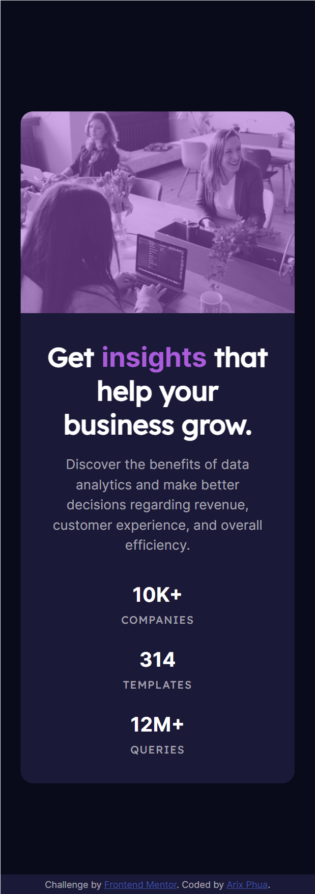

# Frontend Mentor - Stats preview card component solution

This is a solution to the [Stats preview card component challenge on Frontend Mentor](https://www.frontendmentor.io/challenges/stats-preview-card-component-8JqbgoU62). Frontend Mentor challenges help you improve your coding skills by building realistic projects. 

## Table of contents

- [Overview](#overview)
  - [The challenge](#the-challenge)
  - [Screenshot](#screenshot)
  - [Links](#links)
- [My process](#my-process)
  - [Built with](#built-with)
  - [What I learned](#what-i-learned)
- [Author](#author)

**Note: Delete this note and update the table of contents based on what sections you keep.**

## Overview

### The challenge

Users should be able to:

- View the optimal layout depending on their device's screen size

### Screenshot




### Links

- Solution URL: [https://www.frontendmentor.io/solutions/stats-card-using-css-grid-areas-PYRpBPHLV](https://www.frontendmentor.io/solutions/stats-card-using-css-grid-areas-PYRpBPHLV)
- Live Site URL: [https://arixpsy.github.io/frontendmentor/stats-preview-card-component-main/](https://arixpsy.github.io/frontendmentor/stats-preview-card-component-main/)
## My Process
### Built with

- HTML5 Markup
- CSS Variables
- CSS Grid
- Mobile-first workflow

### What I learned

Using picture tag to display different images based on screen size

```html
<picture>
  <source media="(min-width:650px)" srcset="./images/image-header-desktop.jpg">
  
</picture>
```

## Author

- Website - [Arix Phua](https://arixpsy.dev)
- Frontend Mentor - [@arixpsy](https://www.frontendmentor.io/profile/arixpsy)
- Github - [arixpsy](https://github.com/arixpsy)

